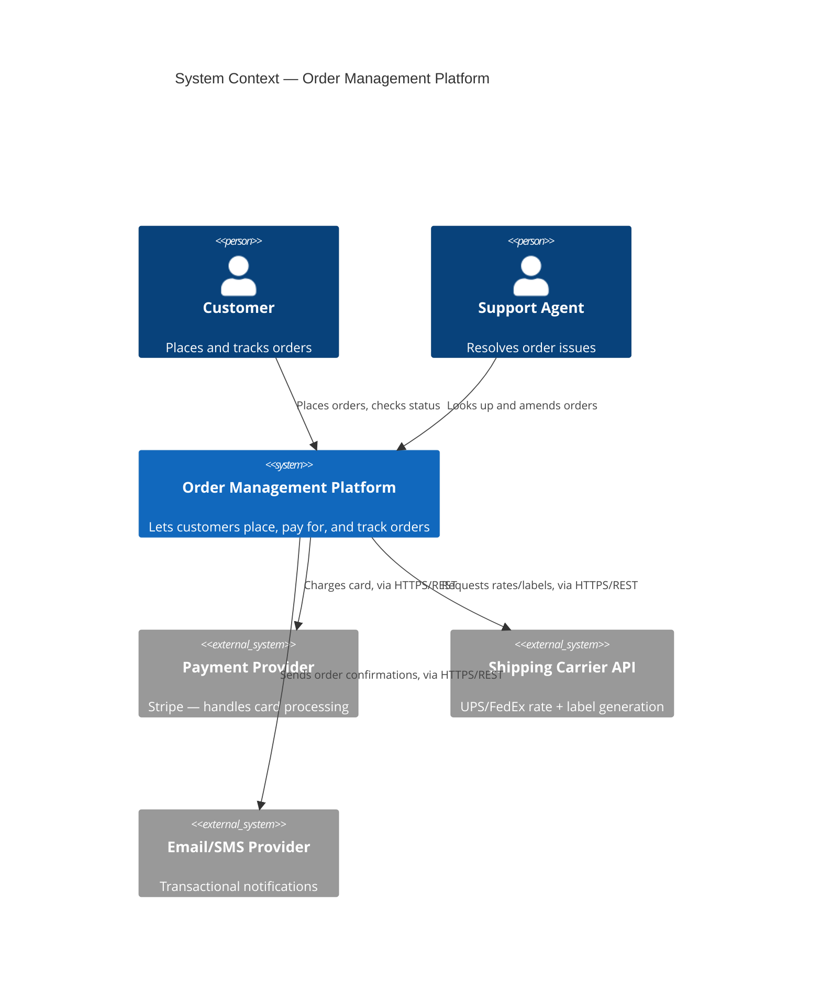
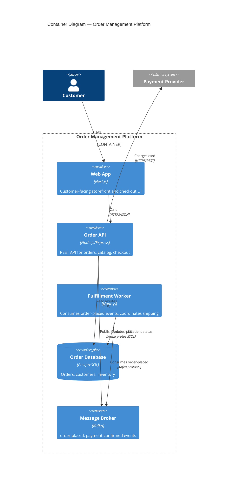
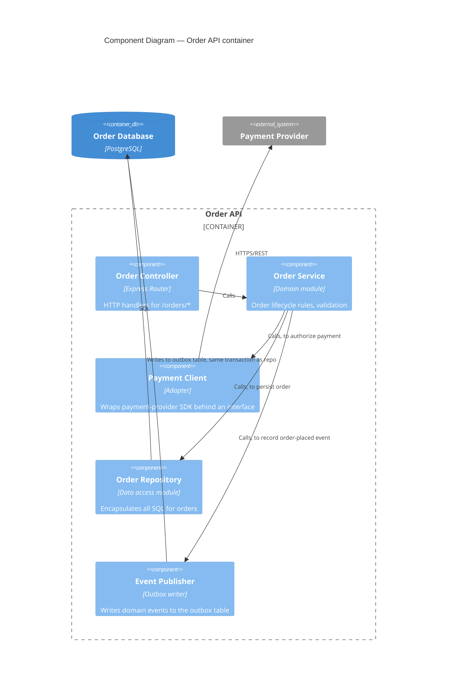
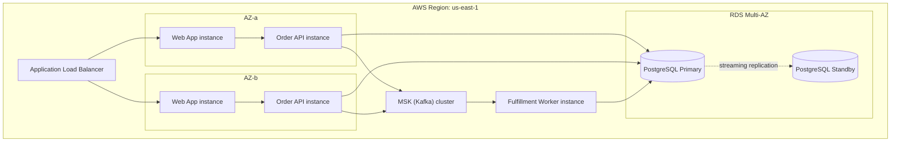

# artifacts-and-templates.md — Deliverable Templates
### File 7 of 10 · Knowledge base for a domain-agnostic solution-architect agent

**Tag legend (repeated from `fundamentals.md` for standalone readability):**
- `[T]` — Timeless. Re-derive only if a citation link rots; the underlying claim doesn't age.
- `[TS]` — Time-sensitive. Refresh per the cadence in `sources-and-currency.md`.
- `[UNVERIFIED]` — Claim the agent should treat as a heuristic in use, not a citable fact.

This file is the agent's **output layer**. `fundamentals.md`, `methodologies.md`, `decision-rules.md`, `stack-selection.md`, `domain-matrix.md`, and `cross-cutting.md` decide *what* the architecture should be; this file is *how the agent writes that decision down* so it survives the meeting, the reorg, and the next engineer. Every template below is meant to be copy-pasted into a repo (`docs/adr/`, `docs/diagrams/`, `docs/risk-register.md`, etc.) and filled in place — not paraphrased.

---

## (a) Architecture Decision Record (ADR) template

**Source:** Michael Nygard, *"Documenting Architecture Decisions,"* Cognitect blog, 15 November 2011, https://cognitect.com/blog/2011/11/15/documenting-architecture-decisions — the format that coined the term "ADR," modeled loosely on the Alexandrian pattern form (context / forces / resolution). `[T]` Companion process reading: Martin Fowler, *"Architecture Decision Record,"* martinfowler.com/bliki/ArchitectureDecisionRecord.html. `[T]`

### When an ADR is warranted (do not skip this gate)

An ADR is the paperwork `fundamentals.md` §7 (RULE 7.1–7.3) demands for a **one-way door**, and the topic-worthiness test is `fundamentals.md` §1 (RULE 1.1: "architecture is the decisions you wish you could get right early"). Concretely:

**RULE 7a.1** — IF a decision passes RULE 7.1's one-way-door test (reversal cost weeks+ **AND** blast radius spans multiple teams or external contracts) THEN write a full ADR using the template below **before** committing, not after. IF it's a two-way door (RULE 7.1, hours-to-days reversal, contained blast radius) THEN a one-paragraph ADR (Title/Context/Decision/Consequences compressed to 4 sentences total) is enough — do not run the full ceremony on it (RULE 7.2 names the false-one-way-door smell to watch for: "we'd have to have a meeting about it" is not evidence of irreversibility).

**RULE 7a.2** — IF the same question keeps resurfacing in Slack/standups (a sign the "shared understanding" Fowler's second definition in `fundamentals.md` §1 depends on has decayed or was never written down) THEN that recurrence, on its own, is grounds for an ADR even if the original decision was a two-way door — the ADR is now serving the tribal-knowledge-loss risk, not the reversal-cost risk.

### Template

```markdown
# ADR-{number}: {Title — short noun phrase, e.g. "Use PostgreSQL logical replication for read replicas"}

## Status
{Proposed | Accepted | Deprecated | Superseded by ADR-XXX}

## Context
{The forces at play — technical, political, social, project-local — in tension,
stated neutrally as facts, not as argument for the decision below.}

## Decision
{"We will..." — active voice, full sentences, one clear decision.}

## Consequences
{What becomes easier and harder as a result. Include the negative
consequences honestly — an ADR with no downsides is a sales pitch, not a record.}
```

### Filled example

```markdown
# ADR-0007: Use PostgreSQL logical replication for read replicas instead of a caching layer

## Status
Accepted

## Context
The reporting dashboard issues read-heavy analytical queries that are starting
to contend with OLTP writes on the primary database, causing p99 write latency
to spike from 40ms to 300ms during nightly report generation. Two candidate
fixes: (a) add a Redis cache in front of the read paths, (b) add a PostgreSQL
streaming/logical-replication read replica and route reporting reads there.
The team has no existing cache-invalidation infrastructure; the reporting
queries are ad-hoc SQL, not a fixed set of cacheable keys. Reversal cost:
the replica is a two-way door (can be torn down in hours); a caching layer
would become a one-way door once report logic starts depending on cache TTLs
implicitly (see anti-patterns.md — cache stampede/thundering herd risk if
TTLs expire simultaneously under load).

## Decision
We will provision a PostgreSQL streaming replica and route all reporting-role
connections to it via the existing connection-string-per-role config. We will
not introduce a caching layer at this time.

## Consequences
Easier: no cache-invalidation logic to build or maintain; reporting queries
can remain ad-hoc SQL; replica lag (typically <2s) is an acceptable staleness
bound the reporting team has signed off on in writing. Harder: replica lag
is a new failure mode the on-call runbook must cover (see verification.md
for the fitness-function check we added); doubles DB compute cost. Revisit
if reporting read volume grows past ~5x current — at that point a cache
becomes the two-way door and this ADR should be superseded, not silently
overridden.
```

---

## (b) Quality-attribute scenario template

**Source:** Len Bass, Paul Clements, Rick Kazman, *Software Architecture in Practice*, SEI Series in Software Engineering, Addison-Wesley (multiple editions). `[T]` Cross-ref `fundamentals.md` §6 (RULE 6.2: a quality attribute with no measurable target "can only be argued about"). This is the tool that operationalizes RULE 6.2, and it is the input artifact ATAM scenario-elicitation sessions consume (`verification.md`).

### Template (six-part scenario)

```markdown
### QA Scenario: {short name}

- **Source**       {who/what generates the stimulus — a user, an attacker, a
                     dependent system, a clock, an operator}
- **Stimulus**      {the condition arriving at the system — a request, a
                     failure, a load spike, a config change}
- **Environment**   {system state when the stimulus arrives — normal
                     operation, degraded mode, startup, overload}
- **Artifact**      {the part of the system stimulated — a service, the
                     whole system, a data store, an API}
- **Response**      {the activity that should occur as a result}
- **Response measure** {a NUMBER — a testable, falsifiable threshold, not
                         an adjective. This is the field RULE 6.2 exists to force.}
```

### Filled example (performance)

```markdown
### QA Scenario: Checkout API under Black Friday load

- **Source**       Retail web/mobile clients (aggregate, not a single attacker)
- **Stimulus**      Request volume ramps from 500 req/s baseline to 6,000 req/s
                     over 10 minutes
- **Environment**   Normal operation, all dependent services healthy
- **Artifact**      Checkout API + its payment-provider integration
- **Response**      System auto-scales the checkout service, sheds non-critical
                     load (recommendation widgets) before shedding checkout traffic,
                     and queues payment-provider calls rather than dropping them
- **Response measure** p99 checkout latency stays < 800ms; zero checkout
                        requests dropped; payment-provider call queue drains
                        within 30s of load returning to baseline
```

### Filled example (a non-performance attribute, to show the template generalizes)

```markdown
### QA Scenario: Operator rotates a database credential

- **Source**       Security/on-call engineer (planned, not incident-driven)
- **Stimulus**      Database password rotated in the secrets manager
- **Environment**   Normal operation, no deploy in progress
- **Artifact**      All services holding a live DB connection pool
- **Response**      Services detect the rotated credential and re-authenticate
                     without a restart or dropped in-flight transaction
- **Response measure** 100% of service instances pick up the new credential
                        within 60s of rotation; zero failed transactions
                        attributable to the rotation
```

**RULE 7b.1** — IF a stakeholder states a requirement as an adjective ("the system must be secure," "reports should be fast") THEN the agent's next question is always "turn that into a scenario with a number in the response measure" — refuse to file the requirement as done until it has all six parts. This is the direct enforcement mechanism for `fundamentals.md` RULE 6.2.

---

## (c) C4 diagrams — Mermaid skeletons

**Source:** Simon Brown, C4 model (System Context, Container, Component, Code), developed 2006–2011, https://c4model.com/. `[T]` The C4 model itself is stable; Simon Brown's own recommended diagramming tooling (Structurizr, PlantUML-C4) changes faster — treat *tool* choice as `[TS]`, the *model* (4 levels of abstraction) as `[T]`.

**Tooling note:** this machine has the `mermaid-harness` skill (backed by the `mmdc` CLI, v11.12.0) which renders any `.mmd` source below to PNG/SVG/PDF locally. Save each skeleton as its own `.mmd` file and invoke the skill rather than hand-rendering.

### C4 Level 1 — System Context



### C4 Level 2 — Container



### C4 Level 3 — Component (inside the Order API container)



### Sequence diagram skeleton (a specific flow through the containers above)

```mermaid
sequenceDiagram
    participant C as Customer (Web App)
    participant A as Order API
    participant P as Payment Provider
    participant DB as Order DB
    participant Q as Kafka
    participant W as Fulfillment Worker

    C->>A: POST /orders (cart, payment token)
    A->>P: Authorize charge
    P-->>A: Charge approved
    A->>DB: BEGIN; INSERT order; INSERT outbox event; COMMIT
    A-->>C: 201 Created (order id)
    Note over A,DB: Outbox pattern — see anti-patterns.md<br/>"dual-write / no-outbox" to see what this avoids
    Q->>W: order-placed event (relayed from outbox)
    W->>DB: UPDATE order SET fulfillment_status = 'processing'
```

### Deployment diagram skeleton



**RULE 7c.1** — IF the audience is executives or another team that needs the "why does this exist" view THEN render Level 1 only. IF the audience is the team owning deployment topology THEN Level 2 + the deployment diagram. IF the audience is engineers debugging or extending one container's internals THEN Level 3. Never hand a Level 3 diagram to someone who needed Level 1 — this is the C4 model's core claim (Brown): different diagrams for different audiences, not one diagram trying to serve all of them.

---

## (d) Tradeoff table template

Direct implementation of `fundamentals.md` §6 RULE 6.1 (force an explicit written ranking of quality attributes before a conflict surfaces).

### Template

```markdown
| Option | {QA 1, e.g. Latency} | {QA 2, e.g. Cost} | {QA 3, e.g. Operability} | {QA 4, e.g. Time-to-ship} | Net |
|---|---|---|---|---|---|
| {Option A} | {rating + 1-line why} | ... | ... | ... | {recommendation + why} |
| {Option B} | ... | ... | ... | ... | ... |
```

### Filled example

```markdown
## Tradeoff: read-path scaling for the reporting workload (ADR-0007's decision context)

Ranked priority for this decision (recorded before comparing options, per RULE 6.1):
1. Operability (team is 3 engineers, no dedicated DBA)
2. Cost
3. Latency (staleness up to a few seconds is acceptable — this is reporting, not checkout)

| Option | Operability | Cost | Latency/staleness | Net |
|---|---|---|---|---|
| Redis cache in front of reads | Poor — needs invalidation strategy, new failure mode, new on-call surface | Low infra cost | Best (sub-ms) if cache hit | Rejected — optimizes the priority-3 attribute at the expense of priority-1 |
| PostgreSQL read replica | Good — reuses existing Postgres ops knowledge, standard AWS RDS feature | Medium (2x DB compute) | ~1-2s replication lag, acceptable per stakeholder sign-off | **Selected** — best fit against the ranked priorities |
| Do nothing, add read-only transaction isolation tuning | Good | Lowest | Doesn't fix root contention | Rejected — treats symptom not cause; write latency still degrades under load |
```

---

## (e) Risk register template

### Template

```markdown
| ID | Risk | Likelihood | Impact | Score | Mitigation | Owner | Status |
|---|---|---|---|---|---|---|---|
| R-{n} | {one sentence, specific} | {L/M/H} | {L/M/H} | {L×I, or numeric} | {concrete action, not "monitor closely"} | {named person/role} | {Open/Mitigated/Accepted/Closed} |
```

### Filled example

```markdown
| ID | Risk | Likelihood | Impact | Score | Mitigation | Owner | Status |
|---|---|---|---|---|---|---|---|
| R-1 | Replica lag exceeds 30s during nightly batch import, serving stale reports | Medium | Medium | 6/9 | Add a fitness-function check (verification.md) alerting if lag > 10s; document acceptable staleness in the reporting team's SLA | @priya (platform) | Open |
| R-2 | Payment provider outage during peak sale event blocks all checkouts | Low | High | 6/9 (H×L on a 3x3 scale) | Add circuit breaker + queued-retry per the "retry storms" entry in anti-patterns.md; degrade to "order accepted, payment pending" UX rather than hard failure | @tomas (checkout) | Mitigated — circuit breaker shipped 2026-05 |
| R-3 | Vendor lock-in to Kafka-specific semantics (exactly-once producer) makes broker migration a one-way door | Low | High | 6/9 | Recorded as a one-way door in fundamentals.md §7 log; wrap producer calls behind an internal interface now, before more consumers depend on Kafka-specific behavior | @arch-team | Open — tracked in one-way-door log, item OWD-4 |
```

**RULE 7e.1** — IF a risk's mitigation column reads as an observation rather than an action ("monitor," "keep an eye on," "revisit later") THEN it is not a mitigation — rewrite it as a concrete, assignable action or explicitly mark the risk "Accepted" with a named accepting owner. An unassigned "monitor" is how risks silently expire without anyone deciding to accept them.

---

## (f) NFR / quality-attribute budget table template

Turns `fundamentals.md` RULE 6.2 into a single trackable document spanning every quality attribute in play, so tradeoffs are visible across attributes at once, not just per-decision (contrast with the QA scenario template in (b), which is per-scenario).

### Template

```markdown
| Quality attribute | Budget / target | Measured how | Current | Status |
|---|---|---|---|---|
| {ISO 25010 category or Bass/Clements/Kazman "-ility"} | {number} | {tool/method} | {number} | {Within budget / At risk / Breached} |
```

### Filled example

```markdown
## NFR budget — Order Management Platform, Q3 2026

| Quality attribute | Budget / target | Measured how | Current | Status |
|---|---|---|---|---|
| Performance (checkout p99 latency) | < 800ms at 6,000 req/s | Load test (k6), pre-release gate | 620ms at 6,000 req/s | Within budget |
| Availability | 99.9% monthly (checkout path only) | Uptime monitor (Pingdom) + incident log | 99.94% trailing 30d | Within budget |
| Recoverability (RPO/RTO) | RPO 5 min, RTO 30 min | Quarterly DR drill | RPO 5 min, RTO 42 min | At risk — RTO drill gap tracked as R-4 |
| Security (dependency CVEs) | Zero Critical/High unpatched > 7 days | `npm audit` / Snyk, CI gate | 0 | Within budget |
| Cost (infra spend per 1k orders) | < $4.50 | Monthly cloud bill / order count | $4.20 | Within budget |
| Maintainability (lead time for a 1-line config change to prod) | < 1 day | Deploy pipeline timestamps | 1.5 days | At risk — flagged in cross-cutting.md deploy-pipeline review |
```

---

## (g) One-way vs. two-way door log template

Direct implementation of `fundamentals.md` §7 RULE 7.3: log every decision classified as a one-way door, even the ones that turn out fine — the log calibrates future classification, it does not just justify past decisions.

### Template

```markdown
| ID | Decision | Reversal cost estimate | Blast radius | Classification | Date | Outcome (fill in later) |
|---|---|---|---|---|---|---|
| OWD-{n} | {one sentence} | {hours/weeks/quarters} | {teams/contracts affected} | {One-way / Two-way} | {date} | {filled in at review, e.g. 6-12mo later — was the classification right?} |
```

### Filled example

```markdown
## One-way / two-way door log — Order Management Platform

| ID | Decision | Reversal cost estimate | Blast radius | Classification | Date | Outcome |
|---|---|---|---|---|---|---|
| OWD-1 | Adopt Kafka as the event backbone for order events | Quarters (every consumer would need rewriting) | 4 teams, 6 consumers | One-way | 2025-11-02 | Pending review 2026-11 |
| OWD-2 | Public order-status webhook payload schema (v1) for partner integrations | Weeks-to-quarters (external parties cache/parse the schema) | External partners (unknown count, no enforcement mechanism) | One-way | 2026-01-15 | Confirmed correct — partner already hardcoded field order; a schema change broke one integration in March, validating the "one-way" caution |
| OWD-3 | Internal folder structure for the Order API repo | Hours | 1 team | Two-way (initially proposed as one-way, downgraded per RULE 7.2 — "we'd have to update everyone's mental map" is inconvenience, not cost) | 2026-02-01 | Correct downgrade — reorganized in an afternoon, zero incidents |
| OWD-4 | Producer code depends directly on Kafka's exactly-once-semantics API rather than an internal abstraction | Quarters if a broker migration is ever needed | Whole platform | One-way | 2026-04-10 | Pending — tracked jointly with risk R-3 above |
```

**RULE 7g.1** — IF an item logged as "one-way" is reviewed 6–12 months later and turns out to have been cheap to reverse after all THEN record that explicitly in the Outcome column (like OWD-3) — this is the feedback signal that recalibrates RULE 7.1's cost/blast-radius estimation for the *next* decision, and it is the reason the log exists at all.

---

## How this file drives the rest

- The ADR template in (a) is the artifact `fundamentals.md` §7 and §1 require the agent to produce — every RULE in `decision-rules.md` that ends in "record this as an ADR" points back here.
- The QA scenario template in (b) is the literal input format `verification.md`'s ATAM procedure and any fitness-function/CI gate consumes — a quality attribute without a filled scenario cannot be verified, only asserted.
- The C4 + sequence + deployment skeletons in (c) are the diagrams `methodologies.md` expects the agent to produce at each stage of any methodology (design review, onboarding doc, incident postmortem).
- The tradeoff table (d) and NFR budget table (f) are what `stack-selection.md` and `domain-matrix.md` expect filled in when comparing candidate technologies or architectures for a specific system class.
- The risk register (e) is cross-referenced by `anti-patterns.md` — several anti-patterns there (retry storms, vendor lock-in, dual-write) are exactly the kind of item that belongs as a row in this register before they become an incident.
- The one-way/two-way door log (g) closes the loop the fundamentals file opens: §7 defines the classification test, this file defines where the classification is written down and how it's later checked against reality.
